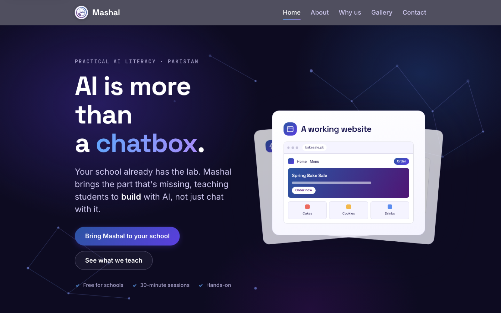

<div align="center">



# Mashal AI Academy

**Practical AI literacy for schools in Pakistan.**

<p>
<a href="https://mashalaiacademy.com"></a>
</p>

<p>


</p>

</div>

<br>

> **A curriculum gap, not an access gap**  
> for school heads and parents in Pakistan

## What it did

Mashal (مشعل, "torch") teaches students to build websites, automations and CRMs with AI, in schools that already have labs and internet but no one teaching them to use AI beyond a chatbot. The site makes that case to school leadership and parents.

## Run it locally

No build step. Serve the folder and open it:

```bash
python3 -m http.server 8000   # http://localhost:8000
```

## Repository layout

```
├── assets/
│   ├── icons/
│   └── images/
├── css/
│   ├── about.css
│   ├── contact.css
│   ├── gallery.css
│   ├── home.css
│   ├── main.css
│   └── tokens.css
├── js/
│   ├── form.js
│   ├── nav.js
│   ├── ring-animation.js
│   └── scroll-reveal.js
├── tools/
│   ├── cutout.js
│   ├── png.js
│   ├── proof.js
│   └── README.md
├── about.html
├── CLAUDE_1.md
├── contact.html
├── CONTEXT.md
├── DESIGN.md
├── gallery.html
├── index.html
├── vercel.json
└── why-us.html
```

---

<div align="center">

<sub>Built by <a href="https://github.com/ibi-raheel">Muhammad Ibrahim Raheel</a> · more work at <a href="https://ibiraheel.com">ibiraheel.com</a></sub>

</div>
